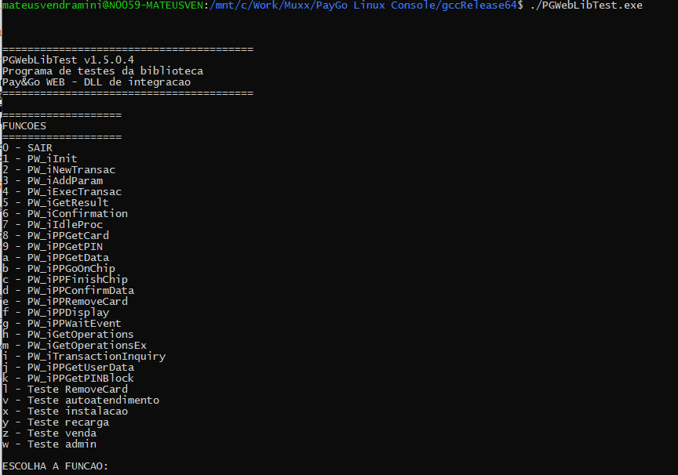
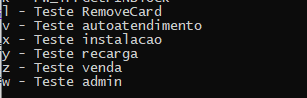
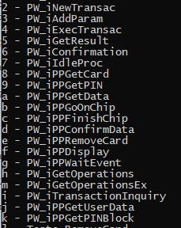

# pdvLinuxPayGoLibC_C
 

## 1. Descrição

Este programa é uma demonstração bem reduzida da integração com a PGWebLib em linux.
Trata-se de um console de testes que permite testar a interface da biblioteca, além de implementar fluxos básicos de transações.

## 2. Compilação

A aplicação é compilada a partir de um makefile e tem quatro configurações diferentes:

- Test (Versão de release 32 bits)
- Test64 (Versão de release 64 bits)
- TestDebug (Versão de debug 32 bits)
- TestDebug64 (Versão de debug 64 bits)

Para compilar o projeto, basta executar no terminal:
> $ make <configuração>

* OBS: Projeto compilado utilizando-se o GNU Make versão 4.2.1 e GCC versão gcc (Ubuntu 9.3.0-17ubuntu1~20.04) 9.3.0 numa máquina Ubuntu 20.04 64bits.

## 3. Operação

Para executar a aplicação, basta rodar o executável compilado em uma pasta que contenha a PGWebLib.so. Na pasta ./Compilados/ é possível encontrar tanto a versão de 32 bits quanto 64 bits da biblioteca.

Importante ressaltar que ambos os aplicativos devem ser compatíveis para que seja possível a execução (por exemplo, ambos compilados como 64 bits).
Além disso, a biblioteca necessita que esteja instalado open ssl, versão 1.1.1 para o correto funcionamento. Para conferir a versão no seu sistema, basta executar no terminal:

> $ openssl version

Para executar o aplicativo, basta executá-lo pelo terminal da pasta onde o executável se encontra:

> $ ./PGWebLibTest.exe

Assim que executado, é exibido uma tela com todas as funções disponíveis:

Seguindo o fluxo da biblioteca, primeiro deve-se chamar PW_iInit, informando um diretório que a aplicação tenha permissões para leitura/escrita.

Após isso, é necessário efetuar uma operação de instalação para habilitar o ponto de captura para transacionar com o Pay&Go Web. Para efetuá-la, pode-se selecionar a operação:
> x - Teste de instalacao

Após isso, o ponto de captura está habilitado para efetuar as demais operações. Estas podem ser efetuadas pelas funções que abstraem os fluxos: 

Ou chamando as funções da API da biblioteca diretamente:

Para detalhamento do fluxos de operação, consultar o documento:

[Especificação de integração](./Especificacaov124.pdf)

## 4. Considerações adicionais

Caso sua IDE apresente os fontes com caracteres ilegíveis, trocar o formato de exibição para ANSI/Windows 1252.
Caso a biblioteca não consiga se comunicar com o PIN-pad, verificar com o fabricante do terminal como configurar para rodar no linux.
Para gertec:
[Manual de instalação gertec PPC-900](https://www.bztech.com.br/arquivos/manual-instalacao-linux-gertec-ppc-900.pdf)